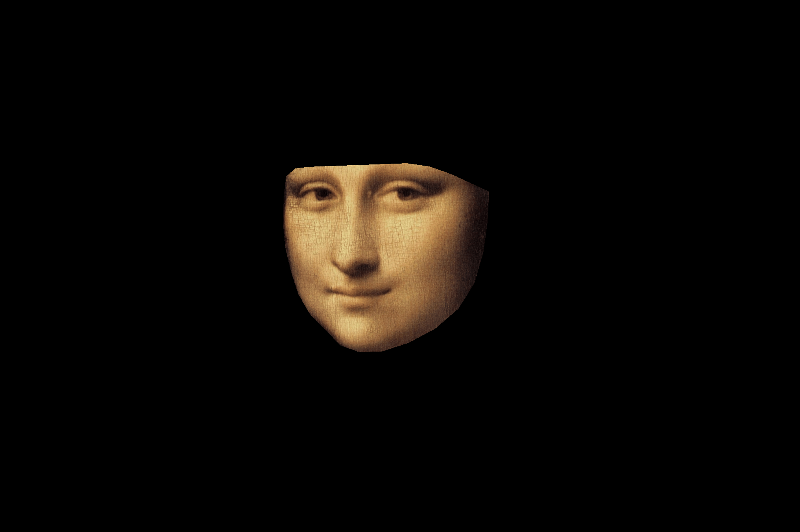

# Face Morphing Project

## Overview

This project implements a face morphing technique that allows users to morph between two facial images. The main script, `main.py`, handles the entire morphing process. Default setups is doing face morphing without view morph. Additionally, users can create GIFs of the morphing process, manually add matching points, and specify morphing values using command-line options.

## Features

- **Automatic Morphing**: Run `main.py` to compute the morphing between two images.
- **GIF Creation**: Use the `--gif` option to create a GIF of the morphing process.
- **Manual Matching Points**: Use the `--manualpoints` option to manually add matching points between the images.
- **Specify Morphing Value**: Use the `--wfrac` option to specify the morphing value.

## Prerequisites

Ensure you have the following packages installed:
- Python 3.x
- NumPy
- OpenCV
- Matplotlib
- Imageio

You can install the required packages using:
```sh
pip install numpy opencv-python matplotlib imageio 
```

## Usage

Desired morphed images should be place into the input directory '/input'. If only one image is place, the mirrored of the image is used for the morphing. If no image is availble or more than 2, the basic image in test_input are used instead.

1. **Basic Morphing**

   To compute the morphing between two images, simply run:
   ```sh
   python main.py
   ```

2. **Create a GIF**
   To create a GIF of the morphing process, use the `--gif` option:
   ```sh
   python main.py --gif
   ```

3. **Manual Matching Points**
   To manually add matching points between the images, use the `--manualpoints` option:
   ```sh
   python main.py --manualpoints
   ```

4. **Specify Morphing Value**
   To specify the morphing value, use the `--wfrac` option followed by the desired value (e.g., `0.5` for 50% morphing):
   ```sh
   python main.py --wfrac 0.5
   ```
5. **Specify if it is a view morphing case**
   To specify if it is a view morphing or not:
	```sh
   python main.py --view
   ```
   TBN : The prewarp process need to be updated by hand according to the match features detectors (face or not)

6. **Specify  if face or objects**

   To specify if it is a morphing of face or object (by default -> face features):
	```sh
   python main.py --noface
   ```

Of course any of the previous options are cumulative and not exclusive (except gif and wfrac as gif already use fixed morphing value to process the desired output)

## Examples

- Compute morphing with a specific morphing value:
  ```sh
  python main.py --wfrac 0.75 
  ```
- Compute morphing with a specific morphing value:
  ```sh
  python main.py --wfrac 0.75 
  ``` 

Here are some examples of the morphed images used during this project :




